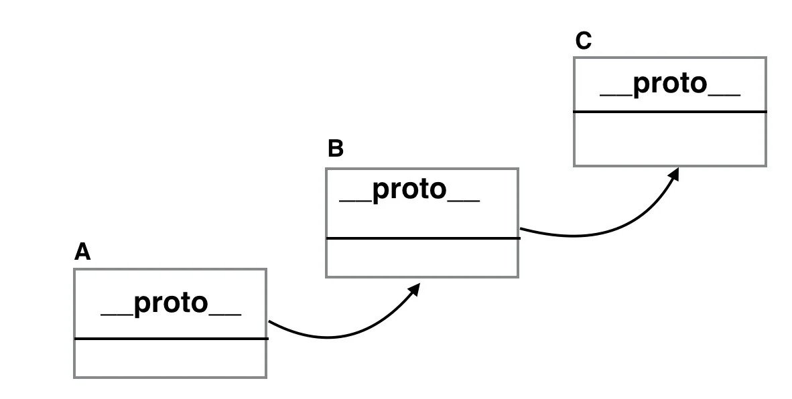

### What is prototype chain ?

Prototypes are the means of inheritance in JavaScript. The prototype of an object would also have a prototype object. This continues until we reach the top level when there is no prototype object.

This is called prototype chaining or prototype chain in JavaScript.

