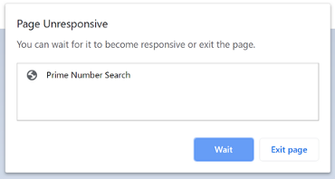

## Why do we use web workers?

Web workers are designed to let you run big jobs without freezing up the page. For example, imagine you want to do some complex calculations when someone clicks a button. If you start doing the job right away, you’ll tie everything up. The person using the page won’t be able to scroll or click anything. They might even get the dreaded “this page is unresponsive” error message.



**worker.js**

```javascript
    function clock() {
        setInterval(() => {
            postMessage(`tick ${new Date().toLocaleTimeString()}`);
        }, 1000);
    }
clock();

```

**index.js**

```javascript
const w = new Worker('./worker.js');
    w.onmessage = function (event) {
        console.log(event.data);
    };
```
