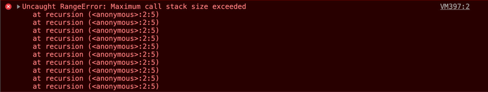

## What is Stack overflow in Javascript?

The call stack has a maximum size assigned. Stack Overflow occurs when the number of function calls added to the stack increases the stack’s maximum limit (the call stack has a maximum size). A classic example to cause such a situation is Recursion. Recursion is a process in which a function calls itself until a terminating condition is found.

```javascript
function recursion(){ 
    recursion(); //a function calling itself 
}
recursion();
```


